<!-- <style> -->

<!-- .html-widget.gauge svg { -->
<!--   height: 200px; /*or try sth like 320px instead of 100%, whatever you prefer*/ -->
<!-- } -->

<!-- </style> -->

```{r setup, include=F}
knitr::opts_chunk$set(echo = F, message = F, warning = F)

library(flexdashboard)
library(tidyverse)
library(tbeptools)
# devtools::load_all('../tbeptools')
library(mapedit)
library(mapview)
library(leaflet.extras)
library(sf)
library(reactable)
library(shinydashboard)
library(plotly)
library(shinyWidgets)
library(extrafont)

# # style file
# styles <- readLines('https://raw.githubusercontent.com/tbep-tech/css-styling/master/styles.css')
# writeLines(styles, 'styles.css')

source('R/funcs.R')

data(tbniscr)

fml <- 'Lato Light'
maxyr <- 2019
perc <- c(32, 46)
cols <- c('red', 'yellow', 'green')

# for shiny server
st_crs(fimstations) <- 4326

# base matrix
tbnimat <- show_tbnimatrix(tbniscr, family = fml, txtsz = NULL) 

# fimstations filtered by bay segments
fimstations <- fimstations[tbseg, ]

# annually averaged data
tbniyrs <- tbniscr %>%
  select(Reference, Year, TBNI_Score, matches('Score')) %>% 
  gather('var', 'val', -Reference, -Year) %>% 
  group_by(Reference, Year, var) %>% 
  summarise(val = mean(val, na.rm = T)) %>% 
  spread(var, val) %>% 
  ungroup %>% 
  mutate(
    Action = findInterval(TBNI_Score, perc),
    outcome = factor(Action, levels = c('0', '1', '2'), labels = c('red', 'yellow', 'green')),
    outcome = as.character(outcome),
    Action = factor(Action, levels = c('0', '1', '2'), labels = c('On Alert', 'Caution', 'Stay the Course'))
  )

# fimstations, clip by segment extents
tbnistations <- fimstations %>% 
  left_join(tbniscr, by = 'Reference') %>% 
  select(Reference, Year, Month, TBNI_Score, NumTaxa, BenthicTaxa, TaxaSelect, NumGuilds, Shannon) %>% 
  mutate(
    Action = findInterval(TBNI_Score, perc),
    outcome = factor(Action, levels = c('0', '1', '2'), labels = c('red', 'yellow', 'green')),
    outcome = as.character(outcome),
    Action = factor(Action, levels = c('0', '1', '2'), labels = c('On Alert', 'Caution', 'Stay the Course'))
  )

avedat <- anlz_tbniave(tbniscr) 
```

```{r reactives}
# table for reactable and download
seltab <- reactive({
  
  # input
  dlsegsel <- input$dlsegsel
  dlyrsel <- input$dlyrsel
  rawsel1 <- input$rawsel1
  
  sel <- tbniscr %>% 
    filter(bay_segment %in% !!dlsegsel) %>% 
    filter(Year %in% !!dlyrsel)
  
  if(rawsel1)
    sel <- sel %>% 
      select(-matches('^Score'))
  
  if(!rawsel1)
    sel <- sel %>% 
      select(Reference, Year, Month, Season, bay_segment, TBNI_Score, matches('Score'))

  out <- sel %>%   
    mutate(
      Action = findInterval(TBNI_Score, perc),
      Action = factor(Action, levels = c('0', '1', '2'), labels = c('On Alert', 'Caution', 'Stay the Course')), 
      Action = as.character(Action)
    )

  req(nrow(out) > 0)
  
  return(out)
  
})

# reactable table
rctseltab <- reactive({
  
  # input
  seltab <- seltab()
  
  out <- reactable(seltab,
    columns = list(
      Reference = colDef(name = 'Site'), 
      bay_segment = colDef(name = 'Bay segment'), 
      Action = colDef(style = function(value){
        
        color <- case_when(
          value == 'On Alert' ~ '#FF000080', 
          value == 'Caution' ~ '#EEEE00', #'#FFFF00', 
          value == 'Stay the Course' ~ '#00CD00'#'#00FF0080'
        )  
        
        list(color = color, fontWeight = "bold")
        
      })
    ),
    defaultColDef = colDef(
      footerStyle = list(fontWeight = "bold"),
      format = colFormat(digits = 0, separators = F),
      resizable = TRUE
    ),
   filterable = T,
   defaultPageSize = 15
  )
  
  return(out)
  
})

# site attainment map
attmap <- reactive({
  
  # inputs
  yrsel1 <- input$yrsel1

  # site scores
  toplo <- tbniyrs %>% 
    filter(Year %in% yrsel1) %>% 
    select(Reference, TBNI_Score, Action, outcome) %>% 
    right_join(fimstations, ., by = 'Reference')
  
  # segment averages
  attyr <- avedat %>% 
    filter(Year %in% yrsel1) %>% 
    left_join(tbseg, ., by = 'bay_segment') 

  # map with custom legends
  mapview(attyr, fill = F, homebutton = F, popup = NULL, legend = F) %>% 
    .@map %>% 
    clearMarkers() %>% 
    leafem::removeMouseCoordinates() %>%
    addPolygons(
      data = attyr, 
      stroke = T, 
      color = 'grey', 
      weight = 1, 
      layerId = ~long_name, 
      fillColor = ~outcome, 
      fillOpacity = 0.3,
      label = ~paste0(bay_segment, ': ', long_name, ', Action: ', Action, ' (', outcome, ')')
    ) %>% 
    addCircleMarkers(
      data = toplo, 
      layerId = ~Reference,
      stroke = TRUE,
      color = 'black',
      fill = TRUE,
      fillColor = ~outcome,
      weight = 1,
      fillOpacity = 1,
      radius= 4,#~scales::rescale(val, from = scls, to = c(5, 20)),
      label = ~paste0('Site ', Reference, ' (TBNI: ', round(TBNI_Score, 1), ', action: ', Action)
    ) %>% 
    addLegend("topright", labels = c("Stay the Course", "Caution", "On Alert"), colors = rev(cols), title = "Bay segment/site <br>matrix outcomes", opacity = 1)
  
})

# site attainment matrix
attmat <- reactive({
  
  # input
  yrsel1 <- input$yrsel1

  lwid <- 1.5
  
  # base matrix with selected year
  p <- tbnimat +
    geom_hline(yintercept = yrsel1 - 0.5, lwd = lwid) + 
    geom_hline(yintercept = yrsel1 + 0.5, lwd = lwid) + 
    geom_segment(aes(x = 0.5, xend = 0.5, y = yrsel1 - 0.5, yend = yrsel1 + 0.5, lwd = lwid)) +
    geom_segment(aes(x = 4.5, xend = 4.5, y = yrsel1 - 0.5, yend = yrsel1 + 0.5, lwd = lwid))
  
  out <- show_matrixplotly(p, tooltip = 'Action')
  
  return(out)

})

# time series plots
timplo <- reactive({
  
  # input
  yrsel1 <- input$yrsel1

  # all segments averaged    
  p1 <- show_tbniscrall(tbniscr, plotly = T) %>% 
    add_segments(x = yrsel1, xend = yrsel1, y = 0, yend = 100, line = list(color = 'red'), name = yrsel1, showlegend = F)
  
  # separate bay segments
  p2 <- show_tbniscr(tbniscr, plotly = T) %>% 
    add_segments(x = yrsel1, xend = yrsel1, y = 0, yend = 100, line = list(color = 'red'), name = yrsel1, showlegend = F)
  
  out <- subplot(p1, p2, nrows = 2, shareX = T, shareY = T, which_layout = 'merge', margin = 0.04) %>% 
    layout(legend = list(orientation = "h", xanchor = "center", x = 0.5, y = 0.52))

  return(out)
  
})

# select fim years on station selection plot
fimyrs <- reactive({
  
  # input
  yrsel2 <- input$yrsel2
  
  # filter by year to map
  out <- tbnistations %>% 
    filter(Year >= yrsel2[1] & Year <= yrsel2[2])
  
  return(out)
  
})

# select fim station data
fimplo <- reactive({
  
  req(selsit)
  
  out <- tbniscr %>% 
    filter(Reference %in% selsit)
 
  return(out)
  
})

# select fim station data text
fimtxt <- reactive({
  
  validate(
    need(!is.null(selsit), 'Select a site on the map to show results')
  )
  
  # input
  fimplo <- fimplo()
  
  out <- paste0('Station: ', fimplo$Reference, ', Year: ', fimplo$Year, ', Month: ', fimplo$Month)
 
  return(out)
  
})

# tbni gauge
tbnigauge <- reactive({
  
  # input
  fimplo <- fimplo()

  out <- gauge(fimplo$TBNI_Score, min = 0, max = 100, label = 'TBNI score', gaugeSectors(
     danger = c(0, perc[1]), warning = perc, success = c(perc[2], 100),
     colors = rev(cols)
    ))
  
  return(out)
  
})

# number of taxa gauge
numtgauge <- reactive({
  
  # input
  fimplo <- fimplo()
  rawsel2 <- input$rawsel2
  
  out <- gaugefun(fimplo, tbniscr, cols, 'NumTaxa', 'Number of Taxa', raw = rawsel2)
  
  return(out)
  
})

# number of benthic taxa gauge
bentgauge <- reactive({
  
  # input
  fimplo <- fimplo()
  rawsel2 <- input$rawsel2
  
  out <- gaugefun(fimplo, tbniscr, cols, 'BenthicTaxa', 'Benthic Taxa', raw = rawsel2)

  return(out)
  
})

# selected taxa gauge
seltgauge <- reactive({
  
  # input
  fimplo <- fimplo()
  rawsel2 <- input$rawsel2

  out <- gaugefun(fimplo, tbniscr, cols, 'TaxaSelect', 'Selected Taxa', raw = rawsel2)

  return(out)
  
})

# number of guilds gauge
guilgauge <- reactive({
  
  # input
  fimplo <- fimplo()
  rawsel2 <- input$rawsel2
  
  out <- gaugefun(fimplo, tbniscr, cols, 'NumGuilds', 'Number of Guilds', raw = rawsel2)
  
  return(out)
  
})

# shannon diversity gauge
shangauge <- reactive({
  
  # input
  fimplo <- fimplo()
  rawsel2 <- input$rawsel2
  
  out <- gaugefun(fimplo, tbniscr, cols, 'Shannon', 'Shannon diversity', rawsel2)
  
  return(out)
  
})

# number of taxa gauge, percentile
numtqgauge <- reactive({
  
  # input
  fimplo <- fimplo()
  fimyrs <- fimyrs()
  
  out <- gaugeqfun(fimplo, fimyrs, 'NumTaxa', 'Number of Taxa')
  
  return(out)
  
})

# number of benthic taxa gauge, percentile
bentqgauge <- reactive({
  
  # input
  fimplo <- fimplo()
  fimyrs <- fimyrs()
  
  out <- gaugeqfun(fimplo, fimyrs, 'BenthicTaxa', 'Benthic Taxa')

  return(out)
  
})

# selected taxa gauge, percentile
seltqgauge <- reactive({
  
  # input
  fimplo <- fimplo()
  fimyrs <- fimyrs()

  out <- gaugeqfun(fimplo, fimyrs, 'TaxaSelect', 'Selected Taxa')

  return(out)
  
})

# number of guilds gauge, percentile
guilqgauge <- reactive({
  
  # input
  fimplo <- fimplo()
  fimyrs <- fimyrs()
  
  out <- gaugeqfun(fimplo, fimyrs, 'NumGuilds', 'Number of Guilds')
  
  return(out)
  
})

# shannon diversity gauge, percentile
shanqgauge <- reactive({
  
  # input
  fimplo <- fimplo()
  fimyrs <- fimyrs()
  
  out <- gaugeqfun(fimplo, fimyrs, 'Shannon', 'Shannon diversity')
  
  return(out)
  
})
```

```{r map}
# site selection map
output$map <- renderLeaflet({
  
  # input
  fimyrs <- fimyrs()
  
  # map with custom legends
  mapview(fimyrs, fill = F, homebutton = F, popup = NULL, legend = F) %>% 
    .@map %>% 
    leaflet::clearMarkers() %>%
    addCircleMarkers(
      data = fimyrs, 
      layerId = ~Reference,
      stroke = T,
      color = 'black',
      fill = TRUE,
      fillOpacity = 1,
      weight = 1, 
      radius = 4, 
      fillColor = ~outcome,
      label = ~paste0('Site ', Reference, ' (TBNI: ', round(TBNI_Score, 1), ', action: ', Action)
    )
  
})

# leaflet proxy for marker select
map <- leafletProxy('map')

# binding for marker select and year
makeReactiveBinding('selsit')

# the selection
observeEvent(input$map_marker_click, {
  selsit <<- input$map_marker_click$id
})

observeEvent(input$map_marker_click, {

  # inputs
  fimyrs <- fimyrs()
  
  # filter the pour points by selection
  selsitplo <- fimyrs %>%
    filter(Reference %in% selsit)

  # clear markers on input select, add all points and selected point
  map <- map %>%
    leaflet::clearMarkers() %>%
    addCircleMarkers(
      data = fimyrs,
      layerId = ~Reference,
      stroke = T,
      color = 'black',
      fill = TRUE,
      fillOpacity = 1,
      weight = 1, 
      radius = 4, 
      fillColor = ~outcome,
      label = ~paste0('Site ', Reference, ' (TBNI: ', round(TBNI_Score, 1), ', action: ', Action)
    ) %>%    
    addCircleMarkers(
      data = selsitplo,
      layerId = ~Reference,
      stroke = F,
      color = '#5C4A42',
      fill = T,
      radius = 14,
      fillOpacity = 0.9, 
      label = ~Reference
    )

})
```

```{r downloadhandlers}
# tbni data
output$seldl <- downloadHandler(
  filename = function(){'tbnidat.csv'},
  content = function(file){
    
    # inputs
    seltab <- seltab()
    
    write.csv(seltab, file, quote = T, row.names = F)
    
  }
)
```

OVERVIEW
===========================================================

Column {.tabset .tabset-fade data-width=650}
-----------------------------------------------------------------------

### USING THE DASHBOARD

<div class = "row">
<div class = "col-md-2"></div>
<div class = "col-md-8">

#### WELCOME TO THE TAMPA BAY NEKTON INDEX DASHBOARD [v1.0](https://github.com/tbep-tech/nekton-dash/releases/tag/v1.0)!

```{r, echo = F, out.width = '100%', fig.align = 'center'}
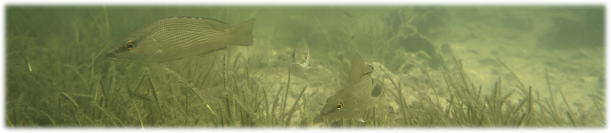
```

The Tampa Bay Nekton Index (TBNI) is a multimetric assessment tool that quantifies the ecological health of the nekton community in Tampa Bay. The index provides a complementary approach to other environmental assessment methods currently available for Tampa Bay (e.g., water quality report card, Benthic index, etc.). The different tabs on the dashboard can be used to view the long-term trends in the TBNI for each bay segment and at individual locations where fish were sampled throughout Tampa Bay.  

1) __BAY SEGMENT RESULTS__: This tab shows the overall assessment of the TBNI as management action categories described in the methods tab. The tab includes an assessment matrix, time series plots of baywide and bay segment results, and an interactive map that shows action categories by year for bay segments and individual sites.
1) __SITE DATA__: This tab shows TBNI results for selected sites, including an assessment of individual metric results.  An interactive map shows all sites across all years.  Selecting a site from the map creates plots showing the overall TBNI and metric outcomes.  Results for each metric can be viewed as scored values, raw values, and as percentiles relative to the rest of the sites on the map.

The plots in this dashboard are interactive and display options can be controlled using a mouse. Most plots include a [control menu](https://help.plot.ly/zoom-pan-hover-controls/) on the top with different options for viewing the data.  For example, click the camera icon to download a png file for a plot.

<br>
```{r, fig.align='center', out.width='30%'}
knitr::include_graphics('www/plotcontrols.PNG')
```
<br>

#### Website information

Technical questions about the TBNI can be sent to [Meagan Schrandt](mailto:Meagan.Schrandt@myfwc.com).  Questions and comments about the dashboard can be sent to [Marcus Beck](mailto:mbeck@tbep.org). The page source content can be viewed on [Github](https://github.com/tbep-tech/nekton-dash).  All data were obtained from the Fisheries Independent Monitoring program collected and maintained by the Florida Fish and Wildlife Conservation Commission (accessible [here](https://geodata.myfwc.com/datasets/68fb6774b58a40a08a6f87959aaa53c4_26/data)). Like this app? Share it on social media using the [\#TampaBayOpenSci](https://twitter.com/hashtag/TampaBayOpenSci?src=hashtag_click) hashtag.  

Citation info here: [](https://zenodo.org/badge/latestdoi/276705811)

</div>
<div class = "col-md-2"></div>
</div>

### METHODS

<div class = "row">
<div class = "col-md-2"></div>
<div class = "col-md-8">

#### How to understand and use the TBNI

The TBNI is a multimetric assessment method that quantifies the ecological health of the nekton community (fish and selected invertebrates) in Tampa Bay. The TBNI uses catch data from the Florida Fish and Wildlife Conservation Commission (FWC) Fish and Wildlife Research Institute’s (FWRI) Fisheries-Independent Monitoring (FIM) program (data available [here](https://geodata.myfwc.com/datasets/68fb6774b58a40a08a6f87959aaa53c4_26/data)). The FIM program uses multiple gear types to sample inshore fish populations in Tampa Bay and other estuaries in the state. The TBNI uses catch data from the 21.3-m bag that has the longest, most consistent sampling record. This sampling gear is ideal for collecting fish in near shore areas, generally as early recruits, juveniles, and smaller-bodied nekton. 

<br>
```{r, fig.align='center', out.width='100%', fig.cap = 'Deploying the 21.3-m bag seine to capture fish and selected invertebrates in the nearshore area.  Photos courtesy of FIM.'}
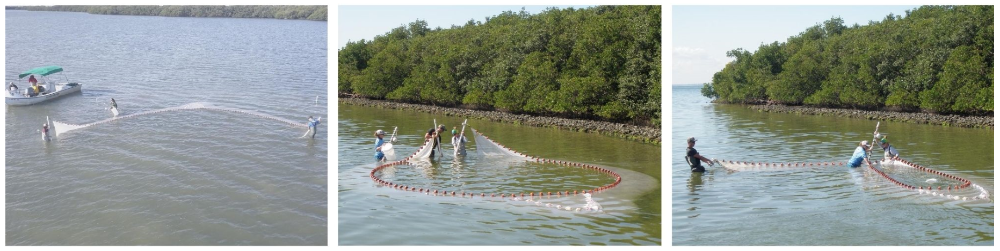
```
<br>

<br>
```{r, fig.align='center', out.width='100%', fig.cap = 'Common species collected in nearshore areas of Tampa Bay that are used in the TBNI.  From left to right, top to bottom: Lined Sole (*Achirus lineatus*), Sheepshead (*Archosargus probatocephalus*), Silver Perch (*Bairdiella chrysoura*), Blue Crab (*Callinectes sapidus*), Spotted Seatrout (*Cynoscion nebulosus*), Tidewater Mojarra (*Eucinostomus harengulus*), Pinfish (*Lagodon rhomboides*), Gray Snapper (*Lutjanus griseus*), Clown Goby (*Microgobius gulosus*), Red Drum (*Sciaenops ocellatus*), Southern Puffer (*Sphoeroides nephelus*), Hogchoker (*Trinectes maculatus*).  Photos courtesy of FIM.'}
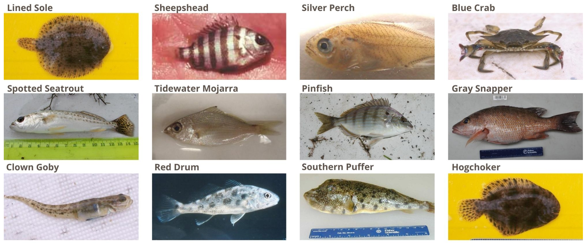
```
<br>

All fish and selected invertebrates captured in the seine are identified to the lowest possible taxon (usually species), counted, and a subset are measured. Current protocols were established in 1998 and TBNI estimates are unavailable prior to this date. Five nekton metrics are estimated from the FIM data. These metrics are sensitive to stressor gradients and provide unique information about Nekton community response to environmental conditions in Tampa Bay. The TBNI metrics include: 

*	*__NumTaxa__*: Species richness
*	*__BenthicTaxa__*: Species richness for benthic taxa
*	*__TaxaSelect__*: Number of “selected” species (i.e., commercially and/or recreationally important)
*	*__NumGuilds__*: Number of trophic guilds
*	*__Shannon__*: Shannon Diversity (H)

Raw metrics are first calculated from the observed data and then scaled to a standard score from 0 – 10.  The overall TBNI score is then estimated from the scaled metrics as: 

<br>
<center>__TBNI__ = 10 x Sum of Metric Scores / 5</center>
<br>

TBNI scores range from 0 to 100, with lower scores suggesting a degraded nekton community and higher scores suggesting a community that is similar to reference or least impacted conditions. 

<br>
```{r, fig.align='center', out.width='70%', fig.cap = 'A __degraded nekton community__ with low diversity and low abundance of organisms.  Water quality and habitat conditions may also be degraded.  Sites with __low TBNI scores__ may have similar characteristics. Image symbols from [ian.umces.edu/symbols](https://ian.umces.edu/symbols).'}
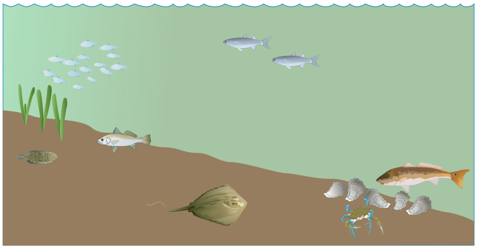
```
<br>

<br>
```{r, fig.align='center', out.width='70%', fig.cap = 'A __healthy nekton community__ with high diversity and high abundance of organisms.  Water quality and habitat conditions support a healthy nekton community.  Sites with __high TBNI scores__ may have similar characteristics. Image symbols from [ian.umces.edu/symbols](https://ian.umces.edu/symbols).'}
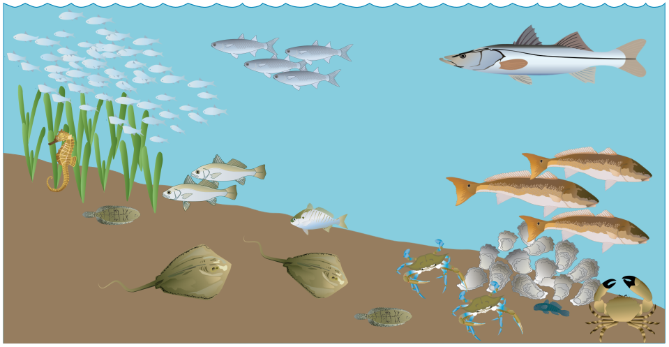
```
<br>

TBNI scores can be translated into actionable management categories with narrative interpretations.  For example, scores above the median TBNI for the dataset used to develop the TBNI indicate a healthy nekton community with a management category of "Stay the Course".  Scores between the 33rd percentile and median are in the "Caution" category and scores below the 33rd percentile are in the "On Alert" category. Each action category has a narrative description to provide guidance to managers:

<span style="color:#33FF3B; text-shadow: 0 0 3px #333;">__Stay the Course__</span>: Continue planned projects. Report data via annual progress reports. 

<span style="color:#F9FF33; text-shadow: 0 0 3px #333;">__Caution__</span>: Review monitoring data and identify additional research/monitoring needs. Begin/continue TAC and Management Board development of specific management recommendations.

<span style="color:#FF3333; text-shadow: 0 0 3px #333;">__On Alert__</span>: Finalize development and implement appropriate management actions to get nekton community back on track.
 
Similar to other reporting indicators for Tampa Bay (e.g., water quality [report card](https://tbeptech.org/TBEP_TECH_PUBS/2020/TBEP_01_20_2019_Decision_Matrix_Update.pdf)), the action categories can be tracked on an annual basis to inform regional planning activities. This dashboard provides a suite of tools to assess historical and current trends in TBNI scores and the supporting metrics.

</div>
<div class = "col-md-2"></div>
</div>

### DOWNLOAD DATA

```{r}
output$rctseltab <- renderReactable(rctseltab())

fillCol(flex = c(0.1, NA, 1),
  fillRow(
    selectInput('dlyrsel', 'Select years:', choices = unique(tbniscr$Year), selected = maxyr, multiple = T),
    selectInput('dlsegsel', 'Select bay segments:', choices = unique(tbniscr$bay_segment), selected = unique(tbniscr$bay_segment), multiple = T),
    materialSwitch(inputId = 'rawsel1', label = 'Raw metric values?')
    ),
  downloadBttn('seldl', 'Download data', style = 'simple', block = T, color = 'success'),
  reactableOutput('rctseltab')
)
```

1 BAY SEGMENT RESULTS
===========================================================

Column {.tabset .tabset-fade data-width=275}
-----------------------------------------------------------------------

### MATRIX RESULTS

```{r}
output$attmat <- renderPlotly(attmat())
plotlyOutput('attmat')
```

### TIME SERIES PLOTS

```{r}
output$timplo <- renderPlotly(timplo())
plotlyOutput('timplo')
```

### Using this tab

This tab shows the overall assessment of the TBNI as management action categories:

<span style="color:#33FF3B; text-shadow: 0 0 3px #333;">__Stay the Course__</span>: Continue planned projects. Report data via annual progress reports. 

<span style="color:#F9FF33; text-shadow: 0 0 3px #333;">__Caution__</span>: Review monitoring data and identify additional research/monitoring needs. Begin/continue TAC and Management Board development of specific management recommendations.

<span style="color:#FF3333; text-shadow: 0 0 3px #333;">__On Alert__</span>: Finalize development and implement appropriate management actions to get nekton community back on track.

The action categories are based on annual averages of scores at all locations where fish were sampled within each of four major segments in Tampa Bay (__OTB__: Old Tampa Bay, __HB__: Hillsborough Bay, __MTB__: Middle Tampa Bay, __LTB__: Lower Tampa Bay).  The results can be viewed in the *MATRIX RESULTS* tab. Hovering the mouse pointer over each cell shows the category assigned to each bay segment in each year.   

<br>
```{r, out.width='70%', fig.align='center'}
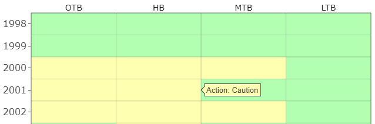
```
<br>

In the above example, the action category for Hillsborough Bay in 2001 was <span style="color:#F9FF33; text-shadow: 0 0 3px #333;">Caution</span>.  

The categories assigned to each bay segment are based on the ranges of values observed for the TBNI in Tampa Bay.  The *TIME SERIES PLOTS* tab shows the breakpoints used for each of the three categories.  Additionally, two plots on the tab show trends over time for the average of all scores and bay segments (top plot) and separately by each bay segment (bottom).   

<br>
```{r, out.width='70%', fig.align='center'}
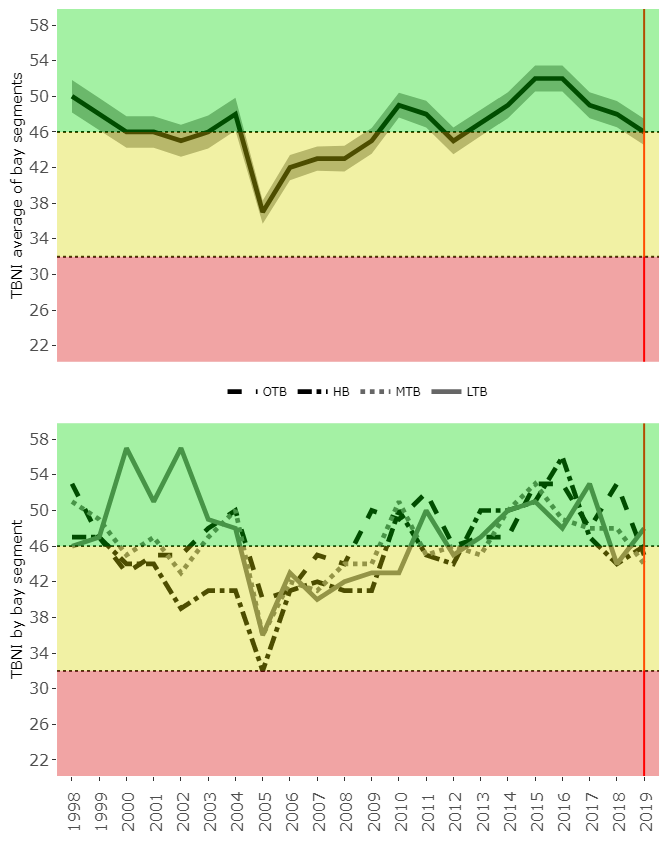
```
<br>

Also note that the trend lines for each bay segment in the bottom plot can be added or removed by clicking on each item in the legend.  The example below shows results only for Hillsborough Bay. 

<br>
```{r, out.width='70%', fig.align='center'}
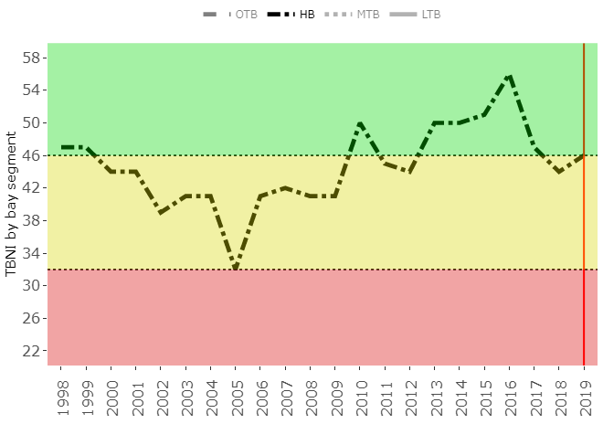
```
<br>

The map on the right shows results for a given year, where the color for each bay segment shows the action category outcome based on the average of site results in each segment. The individual sites are also shown and color-coded by the action categories. Hovering the mouse over a site or bay segment will reveal additional information.  

<br>
```{r, out.width='70%', fig.align='center'}
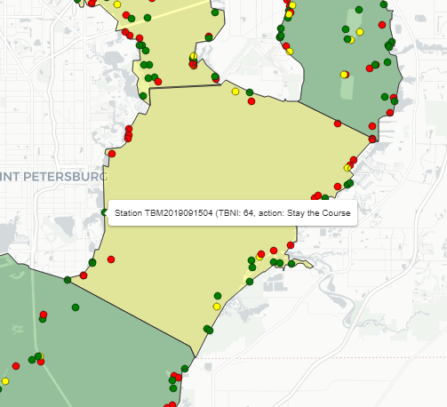
```
<br>

The above example shows results for site TBM2019091504, which was assigned an action category of <span style="color:#33FF3B; text-shadow: 0 0 3px #333;">__Stay the Course__</span> based on a TBNI score of 64.  

Finally, the year slider on the top can be used to select which year is shown on the map. A reference box on the *MATRIX RESULTS* tab and a reference line on the *TIME SERIES PLOTS* shows which year is selected. Selecting the play button will cycle through all years in the data, with the maps and plots updating with each year. 

Column {data-width=500}
-----------------------------------------------------------------------

### RESULTS BY YEAR

```{r}
output$attmap <- renderLeaflet({attmap()})
fillCol(flex = c(NA, 1),
  column(12,
    column(6,
      sliderInput('yrsel1', 'Select year:', min = 1998, max = maxyr, value = maxyr, step = 1, sep = '', width = '200%', animate = T),
    )
  ),
  leafletOutput('attmap')
)
```

2 SITE DATA
===========================================================

Column {.tabset .tabset-fade data-width=275}
-----------------------------------------------------------------------

### MAP SELECTION

```{r}
leafletOutput('map')
```

### Using this tab

This tab shows TBNI results for selected sites where fish were sampled in a given year, including an assessment of individual metric results.  An interactive map shows all sites across all years.  Begin by selecting a site from the map.  The selected site will be shown as a larger, darker point:

<br>
```{r, fig.align='center', out.width='40%'}
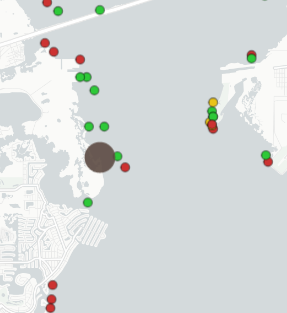
```
<br>

Information about the selected site will appear on the right as several rows of "gauges".  Text will also indicate which site was selected, including the sample year and month (as a number from 1-12). 

<br>
```{r, fig.align='center', out.width='40%'}
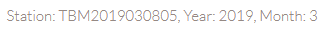
```
<br>

There are three rows of gauges that provide information about the selected site: 

1) *TBNI total*: TBNI score for the site selection
1) *Metrics*: Metric values for the site selection as scaled or raw values
1) *Site percentiles*: Relative metric values as percentiles compared to all other sites on the map

The colors on the gauges represent the action categories defined for the TBNI.  The categories have a meaningful interpretation for the overall TBNI, but are provided only as guides for the metrics.  

The second and third rows show gauges for each of five metrics used in the TBNI: 

*	*__NumTaxa__*: Species richness
*	*__BenthicTaxa__*: Species richness for benthic taxa
*	*__TaxaSelect__*: Number of “selected” species (i.e., commercially and/or recreationally important)
*	*__NumGuilds__*: Number of trophic guilds
*	*__Shannon__*: Shannon Diversity (H)

The *Metrics* gauges show the scaled or raw values for each of the five metrics.  The scaled values are shown by default and range from 0-10 for each metric.  

<br>
```{r, fig.align='center', out.width='100%'}
knitr::include_graphics('www/stationsel3.PNG')
```
<br>

The raw values can be shown by flipping the switch.  This will show the actual values of each metric (e.g., actual taxa counts).

<br>
```{r, fig.align='center', out.width='100%'}
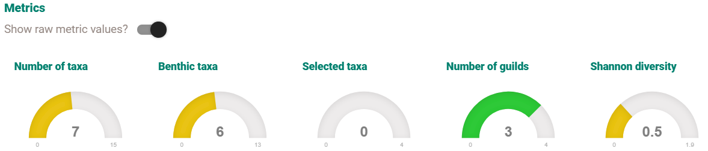
```
<br>

The *Site percentiles* gauges show a comparison of the metrics for the selected site relative to all other metrics shown on the map.  The percentiles can be interpreted as where a metric ranks relative to all others, e.g., a metric at the 50th percentile is at the median across all sites with half the sites scoring lower and half the sites scoring higher for the metric.  

<br>
```{r, fig.align='center', out.width='100%'}
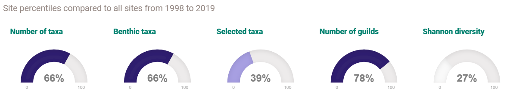
```
<br>

The *Site percentiles* and *MAP SELECTION* can change depending on the selected years. The slider at the top of the page determines which sites are on the map and how the percentiles are calculated based on the selected years. Below shows the same site as for the above gauges, but the year range was changed from 2013 to 2019.

<br>
```{r, fig.align='center', out.width='100%'}
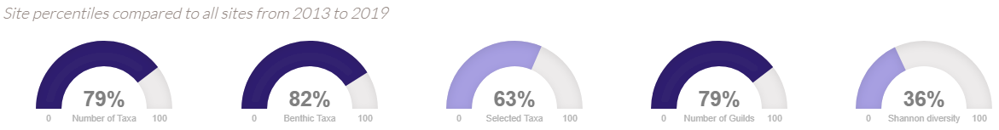
```
<br>

Column {data-width=500}
-----------------------------------------------------------------------

### GAUGES

```{r}
output$tbnigauge <- renderGauge(tbnigauge())
output$numtgauge <- renderGauge(numtgauge())
output$bentgauge <- renderGauge(bentgauge())
output$seltgauge <- renderGauge(seltgauge())
output$guilgauge <- renderGauge(guilgauge())
output$shangauge <- renderGauge(shangauge())
output$numtqgauge <- renderGauge(numtqgauge())
output$bentqgauge <- renderGauge(bentqgauge())
output$seltqgauge <- renderGauge(seltqgauge())
output$guilqgauge <- renderGauge(guilqgauge())
output$shanqgauge <- renderGauge(shanqgauge())

fillCol(flex = c(NA, NA, 0.5, NA, 1, NA, 1),
  column(12,
    column(6,
      sliderInput('yrsel2', 'Select year range on map:', min = 1998, max = maxyr, value = c(1998, maxyr), step = 1, sep = '', width = '200%')
    ), 
    column(6, renderUI(fimtxt()))
  ),
  h4('TBNI total'), 
  # fillRow(
    gaugeOutput('tbnigauge', width= 400, height = 900),
  # ), 
  h4('Metrics'),
  fillCol(
    flex = c(NA, 1),
    materialSwitch(inputId = 'rawsel2', label = 'Show raw metric values?'),  
    fillRow(
      renderUI(shinydashboard::box(gaugeOutput('numtgauge'), title = ttlfun('Number of taxa', input$rawsel2), width = 12)),
      renderUI(shinydashboard::box(gaugeOutput('bentgauge'), title = ttlfun('Benthic taxa', input$rawsel2), width = 12)),
      renderUI(shinydashboard::box(gaugeOutput('seltgauge'), title = ttlfun('Selected taxa', input$rawsel2), width = 12)),
      renderUI(shinydashboard::box(gaugeOutput('guilgauge'), title = ttlfun('Number of guilds', input$rawsel2), width = 12)),
      renderUI(shinydashboard::box(gaugeOutput('shangauge'), title = ttlfun('Shannon diversity', input$rawsel2), width = 12))
    )
  ),
  h4(renderText(paste0('Site percentiles compared to all sites from ', paste(input$yrsel2, collapse = ' to ')))), 
  fillRow(
    shinydashboard::box(gaugeOutput('numtqgauge'), title = HTML('<h5>Number of taxa</h5>'), width = 12),
    shinydashboard::box(gaugeOutput('bentqgauge'), title = HTML('<h5>Benthic taxa</h5>'), width = 12),
    shinydashboard::box(gaugeOutput('seltqgauge'), title = HTML('<h5>Selected taxa</h5>'), width = 12),
    shinydashboard::box(gaugeOutput('guilqgauge'), title = HTML('<h5>Number of guilds</h5>'), width = 12),
    shinydashboard::box(gaugeOutput('shanqgauge'), title = HTML('<h5>Shannon diversity</h5>'), width = 12)
  )
)
```

